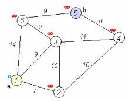

### 思考

该[算法复杂度](https://baike.baidu.com/item/算法复杂度)为n^2,我们可以发现，如果边数远小于n^2,对此可以考虑用[堆](https://baike.baidu.com/item/堆)这种[数据结构](https://baike.baidu.com/item/数据结构/1450)进行优化，取出最短路径的复杂度降为O(1)；每次调整的复杂度降为O（elogn）；e为该点的边数，所以复杂度降为*O*((*m*+*n*)log*n*)



### 实现

\1. 将源点加入堆，并调整堆。 

\2. 选出堆顶元素u（即代价最小的元素），从堆中删除，并对堆进行调整。 

\3. 处理与u相邻的，未被访问过的，满足三角不等式的顶点 

1):若该点在堆里，更新距离，并调整该元素在堆中的位置。

2):若该点不在堆里，加入堆，更新堆。

\4. 若取到的u为终点，结束算法；否则重复步骤2、3。

```java
import java.util.Comparator;
import java.util.PriorityQueue;

public class Dijkstra {

    //假设起点为src, 终点为dst, 图以二维矩阵的形式存储，若graph[i][j] == 0, 代表i,j不相连
//visit[i] == 0,代表未访问,visit[0] == -1代表已访问
    public int Dijkstra(int src, int dst, int[][] graph,int[] visit){
        //节点个数
        int n = graph.length;
        PriorityQueue<Node> pq = new PriorityQueue<>(new Node());
        //将起点加入pq
        pq.add(new Node(src, 0));
        while (!pq.isEmpty()){
            Node t = pq.poll();
            //当前节点是终点，即可返回最短路径
            if(t.node == dst)
                return t.cost;
            //t节点表示还未访问
            if (visit[t.node]==0){
                //将节点设置为已访问
                visit[t.node] = -1;
                //将当前节点相连且未访问的节点遍历
                for (int i = 0; i < n; i++) {
                    if (graph[t.node][i]!=0 && visit[i]==0) {
                        pq.add(new Node(i, t.cost + graph[t.node][i]));
                    }
                }
            }
        }
        return -1;
    }
    //定义一个存储节点和离起点相应距离的数据结构
    class Node implements Comparator<Node> {
        public int node;
        public int cost;

        public Node(){}

        public Node(int node, int cost){
            this.node = node;
            this.cost = cost;
        }
        @Override
        public int compare(Node node1, Node node2){
            return node1.cost-node2.cost;
        }
    }
}
```