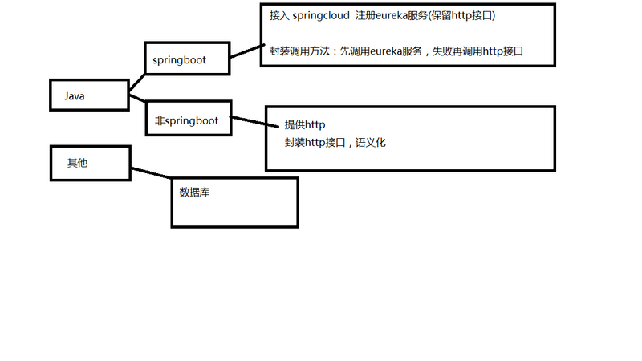
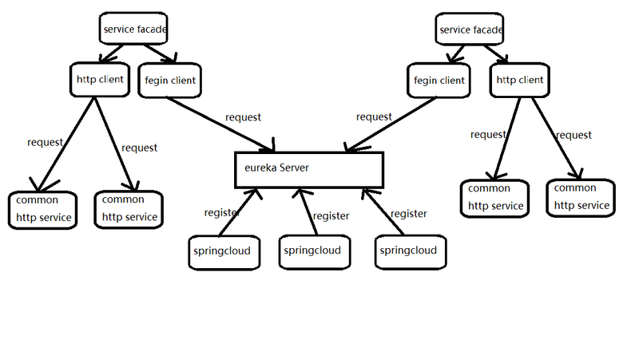

### 传统Http服务与SpringCloud微服务的整合

#### 起因

公司要做系统间的互通，所以需要程序之间互相调用接口，这块一直是其他同事在做，但是今天一个新项目需要调用到其他系统的接口，所以看了下他们的调用方法，发现都是传统的httpclient调用，外面做了一层封装，类似这样:

```
HttpGet httpGet = new HttpGet(url);
HttpClient client = new DefaultHttpClient();
HttpResponse resp = client.execute(httpGet);
HttpEntity entity = resp.getEntity();
String respContent = EntityUtils.toString(entity, "utf-8").trim();
httpGet.abort();
client.getConnectionManager().shutdown();
return respContent;
```

然后在调用的时候，大概是这样:

```
String urls = mapToUrl("");//这里是组合URL的方法
String result = HttpClients.clientDoPost(urls);//这里就是调用上面封装的httpclient
JSONObject json = JSONObject.parseObject(result);//解析返回值
```

这样有什么弊端呢？在我看来最大的一点就是，调用方法没有语义化。
稍微解释一下，这种方法调用写在controller里面，给其他人员看到，首先会理解为：

- 先组合一下URL和参数
- 然后发起一个http请求
- 最后解析http的response

貌似看起来很清晰，其实不然，对整个项目不熟悉的人，完全不知道这三行代码做了哪些事情，做了具体哪些业务操作，只知道我调用了一次http请求。
所以，我决定对项目整体的结构进行改造，然后才有了今天这篇文章。

#### 整体结构设计

公司有很多项目，之前都是外包出去做的，各种语言各种框架的都有，自我入职以来，新的项目我都采用了springboot框架，同时，也让同事使用了这个框架。
所以这次改造，我打算接入springcloud，它和springboot无缝衔接这种天然的优势必须要好好利用。但是还有一些其他项目没有用到springboot，考虑到这种接入cloud比较困难，所以继续保留了httpclient的调用方式。然后设计出大致的结构：



#### 优势对比

既然打算要接入，总要说下好处，不然不能让别人信服，我大致列出来四个。

- 接入简单

  ```
  在springboot上接入springcloud并注册eureka服务器，只需要简单几步，加几个注解就可以完成。
  ```

- 没有显式的IP

  ```
  通常httpclient调用需要指定 IP+context||域名+context 才能定位到某个服务器上的某个具体应用，而通过springcloud的eureka注册中心，在调用时只需指定服务名称，注册中心会自动发现对应的具体服务。
  ```

- 自动负载均衡

  ```
  普通的http后台要做负载均衡，需要借助Nginx或者Apache这样的第三方proxy程序，而springcloud的fegin客户端会自动完成负载操作，发现eureka注册中心上所有可用的服务。
  ```

- 强语义化

  ```
  fegin客户端调用http方法只需要和被调用的方法有一样的方法声明，requestParam注解，只需定义一下接口，feginClient注解会自动帮你实现，这样就可以像调用本地方法一样调用远程接口了。
  ```

#### 具体设计

之前确定了整体的结构，现在就要把实现具体化，首先要把springcloud的服务和普通的http服务联系在一起，然后再具体到某个服务的调用。这里画了一个大致的图例。



普通的http服务还使用httpclient调用，只是多封装了一层语义化，这里先不赘述了，下面说下springcloud服务化以及调用eureka和普通http接口的方法。

#### 注册中心

首先要启动注册中心，去springcloud的GitHub下载[Eureka Sample](https://github.com/spring-cloud-samples/eureka)注册中心模板，然后修改配置,放到服务器上运行。

#### 注册eureka服务

首先，要使一个springboot程序注册为eureka服务，要引入maven包(没有使用maven管理项目的童鞋要自己导包了)

```
<dependency>
    <groupId>org.springframework.cloud</groupId>
    <artifactId>spring-cloud-starter-eureka</artifactId>
</dependency>
<dependency>
    <groupId>org.springframework.cloud</groupId>
    <artifactId>spring-cloud-starter-feign</artifactId>
</dependency>
```

加入dependentsManage管理版本

```
<dependencyManagement>
    <dependencies>
        <dependency>
            <groupId>org.springframework.cloud</groupId>
            <artifactId>spring-cloud-dependencies</artifactId>
            <version>Dalston.SR4</version>
            <type>pom</type>
            <scope>import</scope>
        </dependency>
    </dependencies>
</dependencyManagement>
```

然后在controller上加上注解@EnableEurekaClient注解

```
@EnableEurekaClient
@RestController
public class TestController {

}
```

然后在springbootApplication启动类上要加上@EnableDiscoveryClient，@EnableFeignClients，使它拥有一个fegin客户端的能力。这里就不贴代码了。
最后要修改springboot的配置文件application.yml，增加eureka服务器和自身应用名称的配置

```
eureka:
  client:
    serviceUrl:
      defaultZone: http://ip:port/eureka/
spring:
  application:
    name: your-application-Name
```

这样，你的原有的服务就被改造成springcloud微服务了。

#### fegin调用

fegin调用很简单，只要在接口上加上@FeignClient(value = "应用名"),然后定义下调用的接口声明，就可以了

```
//原接口
@RequestMapping(value = "/hi",method = RequestMethod.GET)
public String sayHiFromClientOne(@RequestParam(value = "name") String name){
     return "hello "+name;   
}
//fegin客户端
@FeignClient(value = "sportsHealth")
public interface TestfeginClient {
    @RequestMapping(value = "/hi",method = RequestMethod.GET)
    String sayHiFromClientOne(@RequestParam(value = "name") String name);
}
```

#### Http调用

这里在httpclient基础上封装成语义化的调用。

```
//继承fegin接口的方法
public interface TestHttpClient extends TestfeginClient {

}
//实现类
@Service
public class TestHttpClientImpl implements TestHttpClient {
    @Override
    public ConcretObject sayHiFromClientOne(String name) {
        Map<String, String> map = new HashMap<>();
        map.put("name",name);
        String urls=MapToUrl("ip"+"context", map);
        String result = HttpClients.clientDoPost(urls);
        ConcretObject ret= JSONObject.parseObject(result, ConcretObject .class);
        return ret;
    }
```

这样调用起来就和fegin以及本地方法无二了

```
//先注入
@Autowired
private TestFeginClient testFeginClient;
@Autowired
private TestHttpClient testHttpClient;
//调用Fegin
testFeginClient.sayHiFromClientOne("张三");
//调用Http
testHttpClient.sayHiFromClientOne("李四");
```

#### Facade Service

虽然现在以及很简单了，但是现在存在一些普通的http接口，以及有些http接口后面要注册到eureka服务但是现在还没接入的。为了尽量统一化调用，不在业务层里httpclient，feginclient混乱调用，我们建立一层facade层，统一化调用，先调用fegin客户端，失败后尝试http调用(ps:这会产生一些性能开销，对实时性要求很强的公司最好就别这样做了，这里是因为我们的实时性并不强，可以接受一点延迟，结合实际情况使用的)
下面是简单的sample：

```
//先继承feginclient接口
public interface TestFacade extends TestFeginClient {

}
//实现facade
@Service
public class TestFacadeImpl implements TestFacade {
    //先注入
    @Autowired
    private TestFeginClient testFeginClient;
    @Autowired
    private TestHttpClient testHttpClient;
    
    //实现接口方法
    @Override
    public ConcretObject sayHiFromClientOne(String name) {
         ConcretObject obj;
         try {
             //调用feginclient
             obj= testFeginClient.sayHiFromClientOne(name);
            }catch (Exception e){
                try {
                    //调用httpclient
                    obj= testHttpClient.sayHiFromClientOne(name);
                }catch (Exception e1){
                    //都调用失败处理
                    obj= new ConcretObject ();
                    obj.setCode("1");
                    obj.setMessage("调用失败");
                }
          }
          return obj;
    }
}
```

